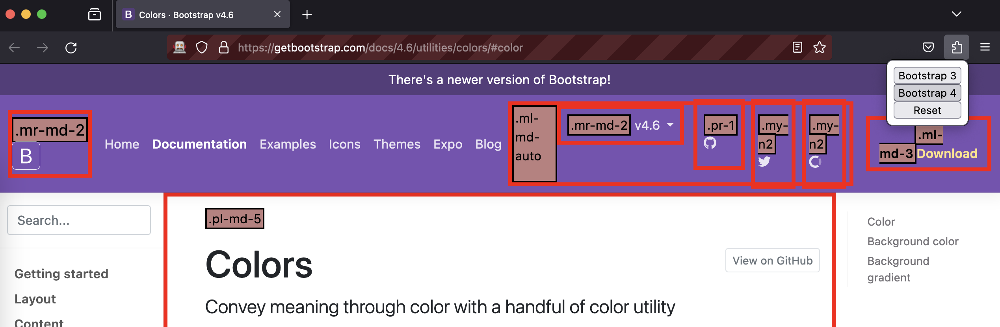

  <h1>Bootstrap Deprecated Classes Extension</h1>
  
Highlight Bootstrap deprecated classes.

  

    
  

  
    

A browser extension highlighting [Bootstrap](https://getbootstrap.com/) deprecated classes in websites.

## Installation

You can install the extension directly from [Firefox Add-ons](https://addons.mozilla.org/firefox/addon/bootstrap-deprecated-classes/), [Chrome Web Store](https://chromewebstore.google.com/detail/bootstrap-deprecated-clas/cfkfbhnancjclhapldjkpllagfjpdihc), or [Microsoft Edge Add-ons](https://microsoftedge.microsoft.com/addons/detail/bootstrap-deprecated-clas/gldcnbcldiippdmakcdppaglkaofoobi).

### Locally

First, run `npm run build` to build the `dist` folder containing all the extension files.

For Firefox, `cd dist/firefox`, and then run:

* `web-ext run --devtools` to launch the extension in Firefox with DevTools.
* `web-ext run -u https://getbootstrap.com/docs/4.6` to launch the extension in Firefox with the Bootstrap 4 docs
* `web-ext build` to build the extension for distribution that will be available in the `dist/firefox/web-ext-artifacts/` folder as a zip file.

For Chrome:
* please follow [Load an unpacked extension](https://developer.chrome.com/docs/extensions/mv3/getstarted/development-basics/#load-unpacked) instructions and load the `dist/chrome` folder.
* `cd dist/chrome`, and then run `web-ext build` to build the extension for distribution that will be available in the `dist/chrome/web-ext-artifacts/` folder as a zip file.

For Microsoft Edge:
* please follow [Sideload an extension](https://learn.microsoft.com/en-us/microsoft-edge/extensions-chromium/getting-started/extension-sideloading) instructions and load the `dist/edge` folder.
* `cd dist/edge`, and then run `web-ext build` to build the extension for distribution that will be available in the `dist/edge/web-ext-artifacts/` folder as a zip file.

## Data

Data are generated by running `npm run generate:data` and are stored in the `data` folder:
* `bootstrap-{$version}-deprecated-classes` contains the list of deprecated classes for the given Bootstrap version which is compared to the latest Bootstrap version.
* `bootstrap-{$version}.json` contains the list of classes for the given Bootstrap version.

## Sponsors

  

## License

Licensed under the MIT License.

See [LICENSE](https://github.com/julien-deramond/bootstrap-deprecated-classes-extension/blob/main/LICENSE) for more information.
